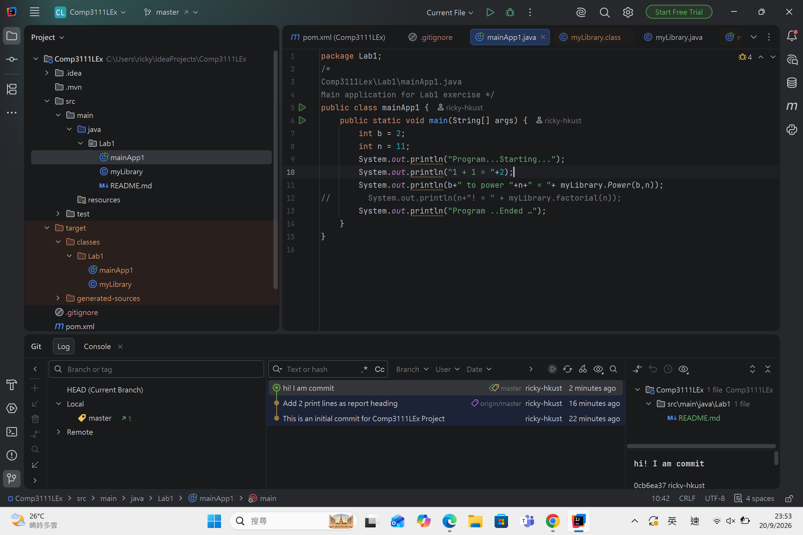

# Comp3111LEx

COMP3111 Lab 1 — Java Maven project built with IntelliJ IDEA.

## Contents
- `myLibrary.java` — library with `power` and `factorial` methods
- `mainApp1.java` — main application

## Build & Run
Open in IntelliJ, press `Ctrl + F9` to build, then run `mainApp1`.

## Screenshot

## Author
Your Name (yourname@ust.hk)